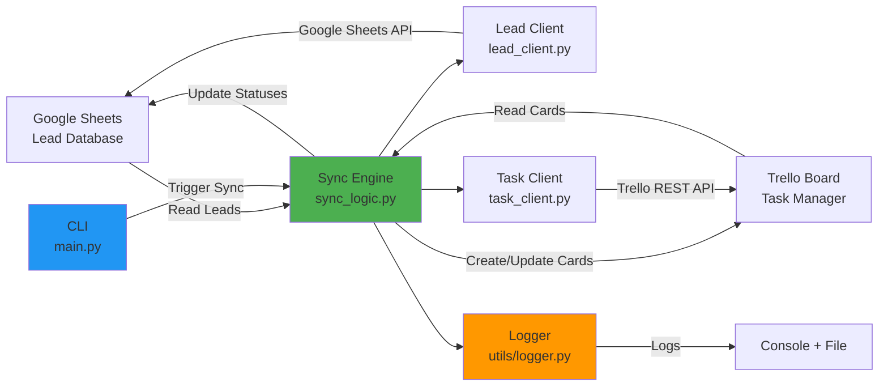

# Google Sheets ↔ Trello Two-Way Sync Automation

> **Automated two-way synchronization system between Google Sheets (Lead Tracker) and Trello (Work Tracker)**

Automatically keep leads and tasks in sync across platforms. When a new lead is added to Google Sheets, a corresponding Trello card is created. When a card's status changes in Trello, the lead's status updates in Google Sheets.

## 🎯 Features

- **Two-way sync**: Changes in Google Sheets sync to Trello, and status updates in Trello sync back to Sheets
- **Automatic card creation**: New leads in Google Sheets automatically create Trello cards
- **Status mapping**: Maps lead status to Trello lists (NEW → TODO, CONTACTED → IN_PROGRESS, QUALIFIED → DONE, LOST → LOST)
- **Idempotent operations**: Uses `trello_task_id` field to prevent duplicates
- **Retry logic**: Exponential backoff for API failures
- **Comprehensive logging**: Track all sync operations
- **CLI interface**: Easy to use command-line tool with `--direction`, `--dry-run`, `--verbose` flags

## 📐 Architecture



**Synchronization Flows:**
- **Flow A (Leads → Tasks)**: Reads leads from Google Sheets, creates/updates Trello cards based on `trello_task_id` presence
- **Flow B (Tasks → Leads)**: Reads Trello cards, updates Google Sheets statuses when divergence detected

## 📋 Prerequisites

1. **Python 3.8+**
2. **Google Account** to create Google Sheet
3. **Google Cloud Project** with Sheets API enabled
4. **Google Service Account** with access to your spreadsheet
5. **Trello Account** with API key and token
6. **Trello Board** with four lists: TODO, IN_PROGRESS, DONE, LOST

## 🚀 Setup Guide

Follow these steps carefully to set up the two-way sync system.

---

## Step 1: Create Google Sheet (Lead Tracker)

### 1.1 Create a New Google Sheet

1. Go to [Google Sheets](https://sheets.google.com)
2. Create a new blank spreadsheet
3. Name it **"Lead Tracker"** (or any name you prefer)
4. Rename the sheet tab to **"Leads"** (important - must match `SHEET_RANGE`)

### 1.2 Set Up Column Headers

In the first row (header row), add these columns **exactly** as shown:

```
id | name | email | status | source | trello_task_id
```

**Column descriptions:**
- `id`: Stable lead identifier (use UUIDs or manual IDs like L001, L002, etc.)
- `name`: Lead's full name
- `email`: Contact email address
- `status`: Lead status (values: NEW, CONTACTED, QUALIFIED, LOST)
- `source`: Where the lead came from (e.g., Website, Referral, Cold Call)
- `trello_task_id`: Blank initially; filled automatically for idempotency

### 1.3 Add Sample Data

Add 2-5 sample rows to test with. Example:

| id | name | email | status | source | trello_task_id |
|----|------|-------|--------|--------|----------------|
| L001 | John Doe | john@example.com | NEW | Website | |
| L002 | Jane Smith | jane@example.com | CONTACTED | Referral | |
| L003 | Bob Johnson | bob@example.com | QUALIFIED | Cold Call | |
| L004 | Alice Brown | alice@example.com | LOST | Website | |

**Important Notes:**
- Use columns A through F (6 columns total)
- Leave `trello_task_id` blank initially
- Status values must be: **NEW**, **CONTACTED**, **QUALIFIED**, or **LOST**

### 1.4 Note Your Sheet ID

Your Google Sheet ID is in the URL:
```
https://docs.google.com/spreadsheets/d/SHEET_ID_HERE/edit
```
Copy this ID - you'll need it for the `.env` file.

---

## Step 2: Enable Google Sheets API + Service Account

### 2.1 Create Google Cloud Project

1. Go to [Google Cloud Console](https://console.cloud.google.com/)
2. Click **"Select a project"** → **"New Project"**
3. Name it (e.g., "Lead Sync Project")
4. Click **"Create"**

### 2.2 Enable Google Sheets API

1. In your project, go to **"APIs & Services"** → **"Library"**
2. Search for **"Google Sheets API"**
3. Click on it and press **"Enable"**

### 2.3 Create Service Account

1. Go to **"APIs & Services"** → **"Credentials"**
2. Click **"Create Credentials"** → **"Service Account"**
3. Fill in:
   - Service account name: `lead-sync-bot`
   - Service account ID: (auto-filled)
   - Description: `Service account for syncing leads`
4. Click **"Create and Continue"**
5. Skip the optional steps (click **"Continue"** → **"Done"**)

### 2.4 Download Credentials JSON

1. Click on the newly created service account email
2. Go to the **"Keys"** tab
3. Click **"Add Key"** → **"Create new key"**
4. Choose **JSON** format
5. Click **"Create"**
6. The JSON file will download - **save it as `service-account.json`** in the project root

### 2.5 Share Google Sheet with Service Account

1. Open the `service-account.json` file
2. Copy the `client_email` value (looks like: `lead-sync-bot@project-id.iam.gserviceaccount.com`)
3. Go to your Google Sheet
4. Click **"Share"** button
5. Paste the service account email
6. Grant **"Editor"** permissions
7. **Uncheck** "Notify people" (it's a bot, not a person)
8. Click **"Share"**

✅ **Google Sheets setup complete!**

---

## Step 3: Create Trello Board & Get Credentials

### 3.1 Create Trello Board

1. Go to [Trello](https://trello.com) and log in
2. Click **"Create new board"**
3. Name it **"Work Tracker"**
4. Click **"Create"**

### 3.2 Create Required Lists

Create these four lists **exactly** (case-sensitive):

1. **TODO** - For new leads
2. **IN_PROGRESS** - For contacted leads
3. **DONE** - For qualified leads
4. **LOST** - For lost leads

### 3.3 Get Trello API Credentials

#### Get API Key:
1. Go to: https://trello.com/app-key
2. Copy your **API Key**

#### Get Token:
1. On the same page, click the **"Token"** link (or manually generate token link)
2. Click **"Allow"** to authorize
3. Copy your **Token**

### 3.4 Get Board ID

**Method 1: From URL**
1. Open your "Work Tracker" board
2. The URL looks like: `https://trello.com/b/BOARD_ID/work-tracker`
3. Copy the `BOARD_ID` part

**Method 2: Using API**
```bash
# Visit this URL in browser (replace YOUR_KEY and YOUR_TOKEN):
https://api.trello.com/1/members/me/boards?key=YOUR_KEY&token=YOUR_TOKEN
```
Find your board in the JSON response and copy the `id`.

### 3.5 Get List IDs

Use this Python snippet or the API method below:

**Python method (recommended):**
```python
import requests

board_id = "your_board_id"
key = "your_api_key"
token = "your_api_token"

response = requests.get(
    f"https://api.trello.com/1/boards/{board_id}/lists",
    params={"key": key, "token": token}
)

print("Your Trello List IDs:")
for list_item in response.json():
    print(f"{list_item['name']}: {list_item['id']}")
```

**API method:**
Visit this URL in your browser (replace values):
```
https://api.trello.com/1/boards/BOARD_ID/lists?key=YOUR_KEY&token=YOUR_TOKEN
```

You'll see JSON with list IDs. Copy each ID:
- TODO list → `TRELLO_LIST_TODO_ID`
- IN_PROGRESS list → `TRELLO_LIST_IN_PROGRESS_ID`
- DONE list → `TRELLO_LIST_DONE_ID`
- LOST list → `TRELLO_LIST_LOST_ID`

✅ **Trello setup complete!**

---

## Step 4: Install Dependencies

### 4.1 Clone or Download Project

```bash
cd automation-two-way-sync
```

### 4.2 Install Python Packages

```bash
pip install -r requirements.txt
```

---

## Step 5: Configure Environment Variables

### 5.1 Create .env File

Copy the example file:
```bash
copy .env.example .env
```

### 5.2 Edit .env with Your Credentials

Fill in ALL the values you collected from Steps 1-3:

```env
# Google Sheets Configuration
GOOGLE_CREDS_PATH=./service-account.json
SHEET_ID=your_google_sheet_id_from_step_1
SHEET_RANGE=Leads!A:F
# Column order: id, name, email, status, source, trello_task_id

# Trello Configuration
TRELLO_KEY=your_trello_api_key_from_step_3
TRELLO_TOKEN=your_trello_token_from_step_3
TRELLO_BOARD_ID=your_board_id_from_step_3
TRELLO_LIST_TODO_ID=list_id_for_TODO
TRELLO_LIST_IN_PROGRESS_ID=list_id_for_IN_PROGRESS
TRELLO_LIST_DONE_ID=list_id_for_DONE
TRELLO_LIST_LOST_ID=list_id_for_LOST
# Status values: NEW, CONTACTED, QUALIFIED, LOST

# Logging Configuration
LOG_LEVEL=INFO
```

**Important:**
- Make sure `service-account.json` is in the project root directory
- Double-check all IDs are correct
- Don't add quotes around the values
- Leave no trailing spaces

---

## Step 6: Verify Setup

Before running the sync, verify your setup:

**Checklist:**
- [ ] Google Sheet created with correct header: `id, name, email, status, source, trello_task_id`
- [ ] Sheet has sample data with status values: NEW, CONTACTED, QUALIFIED, or LOST
- [ ] Google Sheets API enabled in Cloud Console
- [ ] Service account created and `service-account.json` downloaded
- [ ] Sheet shared with service account email
- [ ] Trello board created with lists: TODO, IN_PROGRESS, DONE, LOST
- [ ] Trello API key and token obtained
- [ ] All list IDs collected
- [ ] `.env` file created and filled with all credentials
- [ ] Dependencies installed (`pip install -r requirements.txt`)

---

## 🎮 Usage

### Run the Sync

```bash
python main.py
```

### First Run - What to Expect

On the first run, the sync will:
1. Read all leads from Google Sheets
2. Create Trello cards for each lead in the appropriate list
3. Update the `trello_task_id` column in Google Sheets with the card IDs
4. Display a summary report

### Dry Run (Test Without Changes)

Test the sync without making any changes:

```bash
python main.py --dry-run
```

### Verbose Logging

See detailed debug information:

```bash
python main.py --verbose
```

## 📊 How It Works

### Sync Flow

```
┌─────────────────┐         ┌─────────────────┐
│  Google Sheets  │  ←───→  │     Trello      │
│  (Lead Tracker) │         │ (Work Tracker)  │
└─────────────────┘         └─────────────────┘
```

### Step 1: Sheets → Trello

1. Reads all leads from Google Sheets
2. For each lead:
   - **If no Trello card exists**: Creates a new card
   - **If card exists**: Updates card if name, description, or status changed
   - Updates the "Trello Card ID" and "Last Synced" columns in the sheet

### Step 2: Trello → Sheets

1. Reads all cards from Trello
2. For each card linked to a lead:
   - Checks if the card's list (status) changed
   - Updates the status in Google Sheets if changed
   - Updates the "Last Synced" timestamp

### Status Mapping & Idempotency Rules

#### Idempotency Anchor: `trello_task_id` Column

The `trello_task_id` column is the **idempotency anchor** that prevents duplicate card creation:

1. **Empty `trello_task_id`**: System creates a new Trello card and writes the card ID back to the sheet
2. **Has `trello_task_id`**: System **updates** that card instead of creating a new one
3. Safe to run multiple times without creating duplicates

#### Lead → Trello Mapping (Sheets to Trello)

When syncing from Google Sheets to Trello:

| Lead.status | Trello Action | Description |
|-------------|---------------|-------------|
| **NEW** | Place in TODO list | Fresh lead, not yet contacted |
| **CONTACTED** | Move to IN_PROGRESS list | Lead has been reached out to, in conversation |
| **QUALIFIED** | Move to DONE list | Successfully qualified/won |
| **LOST** | Move to LOST list | Lead lost, rejected, or dead |

**Card Mapping:**
- **Card Title** = Lead name
- **Card Description** = Formatted with:
  - `lead_id: L123` (machine-readable marker for searching)
  - 🆔 Lead ID: L123
  - 📧 Email: {email}
  - 📍 Source: {source}

#### Trello → Lead Mapping (Trello to Sheets)

When syncing status changes from Trello back to Google Sheets:

| Trello List | Lead.status | Description |
|-------------|-------------|-------------|
| **TODO** | NEW | Card in TODO → Lead marked as NEW |
| **IN_PROGRESS** | CONTACTED | Card moved to IN_PROGRESS → Lead marked as CONTACTED |
| **DONE** | QUALIFIED | Card moved to DONE → Lead marked as QUALIFIED |
| **LOST** | LOST | Card moved to LOST → Lead marked as LOST |

#### Status Variations Supported

The system normalizes common status variations automatically:

**NEW variants:** `new`, `todo`, `pending`
**CONTACTED variants:** `contacted`, `in_progress`, `working`, `active`, `reach_out`
**QUALIFIED variants:** `qualified`, `done`, `completed`, `finished`, `won`, `success`
**LOST variants:** `lost`, `rejected`, `cancelled`, `closed_lost`, `dead`

## 📝 Logging & Observability

### Log Configuration

The system uses Python's `logging` module with comprehensive logging capabilities:

**Log Format:**
```
2025-12-03 10:30:15 | sync_logic          | INFO     | ✓ Task created: card_id=abc123, lead_id=L001
2025-12-03 10:30:16 | task_client         | WARNING  | ⚠️  create_card failed (attempt 1/4) | HTTP 429 (Rate Limited)
```

**What Gets Logged:**
- ✅ Timestamp (YYYY-MM-DD HH:MM:SS)
- ✅ Logger name (module)
- ✅ Log level (DEBUG, INFO, WARNING, ERROR)
- ✅ Action type (CREATE, UPDATE, SYNC)
- ✅ Object type (lead, task, card)
- ✅ Object IDs (lead_id, card_id, row_number)
- ✅ HTTP status codes (for API errors)
- ✅ Error messages with context

### Log Levels

Set via `LOG_LEVEL` in `.env`:

```env
LOG_LEVEL=INFO    # Recommended for production
LOG_LEVEL=DEBUG   # Detailed logging for troubleshooting
LOG_LEVEL=WARNING # Only warnings and errors
LOG_LEVEL=ERROR   # Only errors
```

**Log Level Details:**
- `DEBUG`: All operations, API calls, comparisons
- `INFO`: Major operations (create/update), sync progress
- `WARNING`: Retries, rate limits, missing data
- `ERROR`: Failures, exceptions, critical issues

### Console Logging (Default)

By default, all logs output to console (stdout):

```bash
python main.py
# Logs appear in terminal
```

### File Logging (Optional)

Enable persistent log files with rotation:

**1. Enable in `.env`:**
```env
ENABLE_FILE_LOGGING=true
LOG_DIR=./logs
```

**2. Run sync:**
```bash
python main.py
# Logs written to ./logs/sync.log
```

**File Rotation:**
- Max file size: 10MB
- Backup count: 5 files
- Files: `sync.log`, `sync.log.1`, `sync.log.2`, etc.

### Error Handling

#### Per-Record Error Handling

Errors processing individual leads/cards don't crash the entire sync:

```
❌ Error processing lead (ID: L003, Name: Bob, Row: 4): Connection timeout
   → Continuing to next record...
✓ Flow A complete: 10 tasks created, 2 tasks updated, 1 error
```

#### Retry Logic with Exponential Backoff

For transient errors (HTTP 429, 5xx):

```
⚠️  create_card failed (attempt 1/4) | HTTP 429 (Rate Limited)
  → Retrying in 1.0s...
⚠️  create_card failed (attempt 2/4) | HTTP 500 (Server Error)
  → Retrying in 2.0s...
✓ create_card succeeded on attempt 3
```

**Backoff schedule:** 1s → 2s → 4s (3 retries)

#### Non-Retryable Errors

Auth errors and bad requests skip retries:

```
❌ Non-retryable error (HTTP 401) in create_card: Unauthorized
  → Skipping retries for auth/bad request errors
```

**Non-retryable status codes:**
- `401` Unauthorized
- `403` Forbidden
- `400` Bad Request

### Monitoring Sync Operations

**View sync progress:**
```bash
python main.py --verbose
```

**Sample output:**
```
==================== STARTING TWO-WAY SYNC ====================
[FLOW A] Lead → Task: Syncing Google Sheets → Trello
----------------------------------------------------------------------
✓ Found 25 leads to process
[1/25] Processing lead row 2
  [CREATE] New Trello card for lead: John Doe (ID: L001)
  → Writing trello_task_id=abc123 to row 2
✓ Task created: card_id=abc123, lead_id=L001, name=John Doe

[2/25] Processing lead row 3
  [UPDATE] Found trello_task_id=xyz789 for lead Jane (ID: L002)
  Status change: new → contacted
  → Updating Trello card xyz789 with changes
✓ Task updated: card_id=xyz789, lead_id=L002, fields=['status']

✓ Flow A complete: 10 tasks created, 15 tasks updated, 0 skipped

[FLOW B] Task → Lead: Syncing Trello → Google Sheets
----------------------------------------------------------------------
✓ Found 25 cards to process
✓ Mapped 25 leads with trello_task_id

[1/25] Processing card abc123
  Card: John Doe, Lead: John Doe (ID: L001)
  Trello status: qualified, Sheet status: contacted
  Status divergence detected
  → Updating sheet row 2: contacted → qualified
✓ Status synced: lead_id=L001, row=2, new_status=qualified

✓ Flow B complete: 3 statuses synced to sheets

======================== SYNC COMPLETED ========================
📊 SYNC STATISTICS:
  Tasks created:          10
  Tasks updated:          15
  Statuses synced:        3
  Records skipped:        0
  Errors encountered:     0
  Total operations:       28
✓ All operations completed successfully
================================================================
```

## 🧪 Testing

Run the test suite:

```bash
pytest tests/test_sync.py -v
```

Run with coverage:

```bash
pytest tests/test_sync.py --cov=. --cov-report=html
```

## 📁 Project Structure

```
automation-two-way-sync/
├── lead_client.py              # Google Sheets REST API client
│                               # Uses google-auth + googleapiclient.discovery
│                               # Methods: read_leads(), update_lead(), append_lead()
├── task_client.py              # Trello REST API client using requests
│                               # Endpoints: POST /cards, PUT /cards/{id}, GET /boards/{id}/cards
│                               # Methods: create_card(), update_card(), get_card(), get_all_cards()
├── sync_logic.py               # Core two-way sync engine with idempotency
│                               # Handles: Sheets→Trello and Trello→Sheets sync
├── main.py                     # CLI entry point with --dry-run and --verbose flags
├── config.py                   # Configuration loader using python-dotenv
├── utils/
│   ├── __init__.py
│   └── logger.py               # Logging, retry logic with exponential backoff
│                               # Status normalization (NEW/CONTACTED/QUALIFIED/LOST)
├── tests/
│   ├── __init__.py
│   └── test_sync.py            # Unit tests with pytest
├── requirements.txt            # Python dependencies
├── .env.example                # Environment variable template
├── .env                        # Your credentials (gitignored)
├── .gitignore                  # Git ignore file
├── service-account.json        # Google service account credentials (gitignored)
└── README.md                   # This file
```

## 🔄 Automation Options

### Option 1: Schedule with Cron (Linux/Mac)

```bash
# Run every 15 minutes
*/15 * * * * cd /path/to/automation-two-way-sync && python main.py >> sync.log 2>&1
```

### Option 2: Windows Task Scheduler

1. Open Task Scheduler
2. Create Basic Task
3. Set trigger (e.g., every 15 minutes)
4. Action: Start a program
   - Program: `python.exe`
   - Arguments: `main.py`
   - Start in: `C:\path\to\automation-two-way-sync`

### Option 3: Python Scheduler Script

Create `scheduler.py`:

```python
import schedule
import time
from main import main

def job():
    print("\n=== Running scheduled sync ===")
    main()

# Run every 15 minutes
schedule.every(15).minutes.do(job)

print("Scheduler started. Press Ctrl+C to stop.")
while True:
    schedule.run_pending()
    time.sleep(60)
```

Run it:
```bash
python scheduler.py
```

## 🛠️ Troubleshooting

### Common Issues

#### "Google credentials file not found"
- Ensure `service-account.json` exists in the project root
- Check the path in `.env` matches your file location

#### "Missing required environment variables"
- Verify all variables in `.env` are set
- Check for typos in variable names

#### "Permission denied" on Google Sheets
- Share the sheet with the service account email
- Grant Editor permissions

#### "Invalid Trello credentials"
- Verify API key and token are correct
- Ensure token has read/write permissions
- Check that the token hasn't expired

#### "Card not found" errors
- The card may have been deleted in Trello
- The system will automatically create a new card

### Debug Mode

Enable verbose logging:
```bash
python main.py --verbose
```

Check logs for detailed error messages and API responses.

## 🔄 API Implementation Details

### Google Sheets API (lead_client.py)

Uses `google-auth` and `googleapiclient.discovery` with REST API:

```python
# Authentication
from google.oauth2.service_account import Credentials
creds = Credentials.from_service_account_file('service-account.json')
service = build('sheets', 'v4', credentials=creds)

# Get all leads (returns list of dicts with columns mapped to keys)
leads = lead_client.get_all_leads()
# Returns: [{'row_number': 2, 'id': 'L001', 'name': 'John', ...}, ...]

# Find row by lead ID
row_index = lead_client.find_row_by_lead_id('L001')

# Update lead by row index with partial updates
lead_client.update_lead_by_row(row_index, {'status': 'QUALIFIED', 'trello_task_id': 'abc123'})

# Read leads (internal method)
result = service.spreadsheets().values().get(
    spreadsheetId=SHEET_ID,
    range='Leads!A:F'
).execute()

# Update lead (internal method)
service.spreadsheets().values().update(
    spreadsheetId=SHEET_ID,
    range=f'Leads!A{row}:F{row}',
    valueInputOption='RAW',
    body={'values': [[id, name, email, status, source, trello_task_id]]}
).execute()
```

### Trello REST API (task_client.py)

Uses `requests` library with REST endpoints and error logging wrapper:

```python
import requests

BASE_URL = "https://api.trello.com/1"

# Request wrapper with logging (logs status and body on error)
def _request_wrapper(method, url, **kwargs):
    params = kwargs.get('params', {})
    params.update({'key': TRELLO_KEY, 'token': TRELLO_TOKEN})
    response = requests.request(method, url, params=params, **kwargs)
    if response.status_code >= 400:
        logger.error(f"Trello API error: {response.status_code} - {response.text}")
    response.raise_for_status()
    return response

# Create task for lead
card_id = task_client.create_task_for_lead(lead_dict)

# Update task with fields dict
task_client.update_task(card_id, {'name': 'New Name', 'status': 'CONTACTED'})

# Get all cards on board
cards = task_client.get_cards_on_board()

# Get specific card
card = task_client.get_card(card_id)

# Search card by lead_id (looks for 'lead_id: L123' in description)
card = task_client.search_card_by_lead_id('L001')

# Low-level: Create card (REST API)
response = requests.post(
    f"{BASE_URL}/cards",
    params={
        'key': TRELLO_KEY,
        'token': TRELLO_TOKEN,
        'name': lead_name,
        'desc': description,
        'idList': list_id
    }
)

# Low-level: Update card (REST API)
response = requests.put(
    f"{BASE_URL}/cards/{card_id}",
    params={
        'key': TRELLO_KEY,
        'token': TRELLO_TOKEN,
        'idList': new_list_id  # Move to different list
    }
)

# Low-level: Get all cards on board (REST API)
response = requests.get(
    f"{BASE_URL}/boards/{board_id}/cards",
    params={'key': TRELLO_KEY, 'token': TRELLO_TOKEN}
)
```

**Key/Token in Query Params:** All Trello API requests include `key` and `token` as query parameters for authentication.

## 🔐 Security Notes

- **Never commit** `.env` or `service-account.json` to version control
- Store credentials securely
- Use environment-specific service accounts for production
- Regularly rotate Trello tokens
- Monitor API usage limits

## 📊 API Rate Limits

- **Google Sheets API**: 100 requests per 100 seconds per user
- **Trello API**: 300 requests per 10 seconds (100/10s for public boards)

The built-in retry logic handles rate limiting automatically.

## 🤝 Contributing

Contributions are welcome! Areas for improvement:

- Web dashboard for monitoring
- Webhook support for real-time sync
- Support for custom fields
- Conflict resolution strategies
- Multi-sheet support

## 📄 License

This project is provided as-is for educational and personal use.

## ⚠️ Edge Cases and Limitations

### Race Conditions
**Issue**: Both Google Sheets and Trello are modified simultaneously between sync runs.

**Behavior**: **Last-writer-wins** strategy
- If a lead status changes in Sheets and the corresponding Trello card moves to a different list before the next sync, the sync will detect the divergence during Flow B (Task → Lead)
- The Trello status will overwrite the Sheet status since Trello is considered the source of truth for status changes in Flow B
- **Recommendation**: Run sync frequently (e.g., every 5 minutes) to minimize race condition windows

**Example**:
```
Time 0: Lead status = "NEW" in both Sheets and Trello
Time 1: User updates Sheet to "CONTACTED"
Time 2: User moves Trello card to "DONE" list
Time 3: Sync runs
Result: Sheet status = "QUALIFIED" (from Trello DONE list)
```

### Deleted Trello Cards
**Issue**: A Trello card linked via `trello_task_id` is deleted manually on Trello.

**Current Behavior**: 
- During Flow B (Task → Lead), the script fetches all cards on the board
- If `trello_task_id` points to a deleted card, it won't be found in the card list
- The lead is skipped (not updated) and logged as "Card not found"
- `trello_task_id` remains in the Sheet (orphaned reference)

**Recommendation**:
- **Option 1**: Manually clear the `trello_task_id` cell in Sheets → next sync will recreate the card
- **Option 2**: Future enhancement to detect orphaned IDs and auto-clear them
- **Option 3**: Restore the deleted card from Trello's "Closed Cards" menu

**Log Output**:
```
⊘ Card {card_id} not found on board (possibly deleted) - lead {lead_id} skipped
```

### Rate Limits

**Google Sheets API**:
- Limit: 100 requests per 100 seconds per user
- Quota: 500 requests per 100 seconds per project
- **Mitigation**: Built-in exponential backoff retry for 429 errors

**Trello REST API**:
- Limit: 300 requests per 10 seconds (30/sec average)
- Public boards: 100 requests per 10 seconds (10/sec average)
- **Mitigation**: 
  - Retry with exponential backoff (1s → 2s → 4s)
  - Batch operations where possible
  - Use `get_all_cards()` once per sync instead of individual card fetches

**Best Practices**:
- Run sync at reasonable intervals (e.g., every 5-10 minutes, not every second)
- Use `--dry-run` for testing without consuming quota
- Monitor API usage in Google Cloud Console and Trello Developer Dashboard

### Google Sheets Row Reordering
**Issue**: Users manually reorder rows in Google Sheets, causing row indices to shift.

**Current Behavior**: 
- The system uses `row_number` (row index) to update specific rows
- `get_all_leads()` reads the entire range and assigns `row_number` based on current position
- `find_row_by_lead_id(lead_id)` searches the entire sheet for matching `id` column

**Protection**:
- **Stable `id` column**: Each lead has a unique, stable identifier (e.g., L001, L002)
- `find_row_by_lead_id()` searches by `id` column, not row index
- Updates use the dynamically found row number

**Example**:
```python
# User reorders rows
# Before: L001 at row 2, L002 at row 3
# After:  L002 at row 2, L001 at row 3

# Sync handles this correctly:
row = lead_client.find_row_by_lead_id("L001")  # Returns 3 (new position)
lead_client.update_lead_by_row(row, updates)   # Updates row 3 correctly
```

**Important**: 
- ⚠️ **Never delete the `id` column** - it's the stable identifier
- ⚠️ **Don't manually edit `trello_task_id`** - let the sync manage it
- ✅ **Safe to reorder rows** - system uses `id` for matching

### Concurrent Edits
**Issue**: Multiple users editing the same Google Sheet simultaneously.

**Behavior**:
- Google Sheets API handles concurrent writes with its own conflict resolution
- The sync reads the current state at sync time, so it always operates on the latest data
- No additional locking mechanism implemented

**Recommendation**: Designate sync as the primary editor, or run sync when manual editing is minimal.

### Missing or Invalid Data
**Issue**: Required fields (id, name, email) are missing or contain invalid data.

**Behavior**:
- Empty leads (all fields blank) are skipped with debug log
- Leads with missing `id` are processed but logged with "ID: unknown"
- Invalid status values default to "NEW" after normalization
- Trello API will reject cards with invalid list IDs (logged as error, sync continues)

**Validation**:
```python
# Lead validation in _process_lead_to_task()
if not any([lead_id, name, email]):
    logger.debug(f"⊘ Skipping empty lead at row {row_number}")
    self.sync_stats['skipped'] += 1
    return
```

### Idempotency Guarantees
**Guarantee**: Running sync multiple times with the same data produces the same result (no duplicates).

**Mechanism**: The `trello_task_id` column acts as idempotency anchor:
```
If trello_task_id is empty:
  → CREATE new card, write card ID back to Sheet
If trello_task_id exists:
  → UPDATE existing card (no duplicate created)
```

**Edge Case**: If `trello_task_id` is manually edited to an invalid/deleted card ID, the sync will fail to update and log an error, but won't create a duplicate.

## 🆘 Support

For issues or questions:
1. Check the edge cases and limitations section above
2. Review logs with `--verbose` flag
3. Verify API credentials are correct
4. Ensure sheet structure matches expected format
5. Check that `id` column values are unique and stable

## 🌐 API Endpoints Reference

### Google Sheets API Endpoints

| Method | Endpoint | Purpose |
|--------|----------|---------|
| GET | `/v4/spreadsheets/{spreadsheetId}/values/{range}` | Read lead data from sheet |
| PUT | `/v4/spreadsheets/{spreadsheetId}/values/{range}` | Update specific row with `trello_task_id` or status |
| POST | `/v4/spreadsheets/{spreadsheetId}/values/{range}:append` | Append new lead row |

**Authentication**: OAuth 2.0 Service Account with JWT
**Base URL**: `https://sheets.googleapis.com/v4`
**Rate Limit**: 100 requests per 100 seconds per user

### Trello REST API Endpoints

| Method | Endpoint | Purpose |
|--------|----------|---------|
| POST | `/1/cards` | Create new Trello card from lead |
| PUT | `/1/cards/{cardId}` | Update card name, description, list (status) |
| GET | `/1/boards/{boardId}/cards` | Fetch all cards on board |
| GET | `/1/cards/{cardId}` | Get single card details |

**Authentication**: API Key + Token as query parameters (`?key=...&token=...`)
**Base URL**: `https://api.trello.com/1`
**Rate Limit**: 300 requests per 10 seconds

**Example Request (Create Card)**:
```bash
POST https://api.trello.com/1/cards?key=YOUR_KEY&token=YOUR_TOKEN
Content-Type: application/json

{
  "name": "L001 - John Doe",
  "desc": "lead_id: L001\nEmail: john@example.com",
  "idList": "list_id_for_NEW_status"
}
```

## 🎥 Video Content Checklist

If creating a video walkthrough, cover these topics:

### Part 1: Setup (10-15 minutes)
- [ ] Create Google Sheet with proper structure
- [ ] Enable Google Sheets API in Google Cloud Console
- [ ] Create service account and download JSON key
- [ ] Share Google Sheet with service account email
- [ ] Create Trello board with 4 lists (TODO, IN_PROGRESS, DONE, LOST)
- [ ] Get Trello API key and token
- [ ] Clone repository and install dependencies
- [ ] Configure `.env` file with all credentials

### Part 2: First Sync (5-10 minutes)
- [ ] Add sample leads to Google Sheet
- [ ] Run first sync: `python main.py`
- [ ] Show Trello cards created
- [ ] Verify `trello_task_id` populated in Sheets
- [ ] Demonstrate dry-run mode: `python main.py --dry-run`

### Part 3: Two-Way Sync Demo (10-15 minutes)
- [ ] Add new lead in Google Sheets → sync → verify Trello card
- [ ] Move Trello card to different list → sync → verify Sheets status updated
- [ ] Show idempotency: sync same lead twice, no duplicates
- [ ] Demonstrate directional sync: `python main.py --direction leads-to-tasks`
- [ ] Show verbose logging: `python main.py --verbose`

### Part 4: Error Handling (5 minutes)
- [ ] Introduce invalid status → show error logged but sync continues
- [ ] Disconnect internet → show retry logic with exponential backoff
- [ ] Review log files in `logs/` directory

### Part 5: Testing & Code Walkthrough (10 minutes)
- [ ] Run unit tests: `pytest tests/test_sync.py -v`
- [ ] Explain architecture diagram
- [ ] Walk through `sync_logic.py` Flow A & Flow B
- [ ] Explain status normalization and mapping
- [ ] Show retry decorator logic

## ✅ Implementation Checklist

This project follows a complete implementation checklist for building the two-way sync system:

### Core Configuration ✅
- [x] **config.py** - Environment configuration loader
  - Loads `.env` variables with `python-dotenv`
  - Validates required credentials (SPREADSHEET_ID, TRELLO_KEY, TRELLO_TOKEN, etc.)
  - Provides `Config` class with all settings

### Utilities ✅
- [x] **utils/logger.py** - Structured logging and retry logic
  - Console + rotating file handler (10MB limit, 5 backups)
  - Log format: `timestamp | module | level | message`
  - `retry_with_backoff()` decorator with exponential backoff (1s → 2s → 4s)
  - `normalize_status()` function for status mapping
  - `get_current_timestamp()` for ISO timestamps

### API Clients ✅
- [x] **lead_client.py** - Google Sheets API wrapper
  - `get_all_leads()` - Fetch all leads from sheet with row numbers
  - `find_row_by_lead_id(lead_id)` - Search for lead by stable ID column
  - `update_lead_by_row(row_index, updates)` - Update specific row (partial updates)
  - `read_leads()` - Raw Sheets API read operation
  - `update_lead(row_index, lead_data)` - Full row update
  - `append_lead(lead)` - Add new lead row

- [x] **task_client.py** - Trello REST API wrapper
  - `create_task_for_lead(lead)` - Create Trello card from lead dict
  - `update_task(card_id, fields)` - Update existing card
  - `get_cards_on_board()` - Fetch all cards on board
  - `search_card_by_lead_id(lead_id)` - Find card by lead_id in description
  - `get_status_from_list_id(list_id)` - Map Trello list to status
  - `format_card_description(lead)` - Format card description with lead_id marker
  - `_request_wrapper(method, url, **kwargs)` - Error logging wrapper for API calls

### Synchronization Engine ✅
- [x] **sync_logic.py** - Core two-way sync orchestrator
  - `run_sync()` - Main entry point, runs both flows
  - **Flow A: `_sync_leads_to_tasks()`** - Google Sheets → Trello
    - `_process_lead_to_task(lead)` - Process individual lead with CREATE/UPDATE logic
    - Uses `trello_task_id` for idempotency (empty = CREATE, exists = UPDATE)
  - **Flow B: `_sync_tasks_to_leads()`** - Trello → Google Sheets
    - `_process_task_to_lead(card, lead_map)` - Process individual card status
    - Detects status divergence and syncs back to Sheets
  - `get_sync_report()` - Generate human-readable sync statistics
  - Per-record error handling to prevent cascade failures

### Command Line Interface ✅
- [x] **main.py** - CLI entry point with argparse
  - `--direction` - Control sync flow: `both`, `leads-to-tasks`, `tasks-to-leads`
  - `--dry-run` - Read-only simulation mode (no writes)
  - `--verbose` - Enable DEBUG logging
  - Exit codes: 0 (success), 1 (errors encountered)

### Testing ✅
- [x] **tests/test_sync.py** - Comprehensive unit tests (17 tests)
  - Status normalization tests (5 tests)
  - SyncEngine initialization tests (2 tests)
  - Lead → Task creation/update tests (3 tests)
  - Task → Lead update tests (2 tests)
  - Idempotency tests (1 test)
  - Error handling tests (2 tests)
  - Report generation test (1 test)
  - Timestamp utility test (1 test)

### Documentation ✅
- [x] **requirements.txt** - Python dependencies
  ```
  google-api-python-client==2.110.0
  requests==2.31.0
  python-dotenv==1.0.0
  pytest==7.4.3
  ```

- [x] **.env.example** - Environment variable template
  ```
  SPREADSHEET_ID=your_google_sheet_id
  SHEET_RANGE=Leads!A:F
  SERVICE_ACCOUNT_FILE=service-account.json
  TRELLO_API_KEY=your_trello_api_key
  TRELLO_TOKEN=your_trello_token
  TRELLO_BOARD_ID=your_board_id
  ```

- [x] **README.md** - Complete setup and usage guide
  - Prerequisites and installation
  - Step-by-step Google Sheets setup
  - Step-by-step Trello setup
  - Google Cloud Console configuration
  - Architecture diagram (Mermaid)
  - Status mapping table
  - API endpoints reference
  - Edge cases and limitations
  - Video content checklist
  - AI usage notes
  - Demo walkthrough with examples

### Status Mapping Table ✅
| Google Sheets Status | Trello List | Normalized Internal |
|---------------------|-------------|---------------------|
| NEW, TODO, new | TODO | `new` |
| CONTACTED, IN_PROGRESS, in progress | IN_PROGRESS | `contacted` |
| QUALIFIED, DONE, complete | DONE | `qualified` |
| LOST, lost | LOST | `lost` |

## 🤖 AI-Assisted Development Notes

This project was developed with assistance from GitHub Copilot and ChatGPT, following best practices for production-ready code.

### Design Patterns Implemented
- **Modular Architecture**: Separate concerns (API clients, sync logic, utilities)
- **Comprehensive Error Handling**: Per-record try/except to prevent cascade failures
- **Idempotency**: Uses `trello_task_id` as anchor to prevent duplicate operations
- **Smart Retry Logic**: Distinguishes between transient (429, 5xx) and permanent (401, 403, 400) errors
- **Extensive Logging**: Every operation logged with context
- **Test Coverage**: Unit tests for all critical flows including status normalization, idempotency, error handling

### Copilot/ChatGPT Prompts Used

**Phase 1: Initial Setup**
1. "Create a two-way synchronization system between Google Sheets and Trello with Python"
2. "Design a schema for lead tracking with columns: id, name, email, status, source, trello_task_id"
3. "Implement Google Sheets API client using service account authentication"
4. "Implement Trello REST API client with error logging wrapper"

**Phase 2: Core Logic**
5. "Implement idempotency using trello_task_id column to prevent duplicate card creation"
6. "Create two-way sync logic: Leads → Tasks (CREATE/UPDATE) and Tasks → Leads (status sync)"
7. "Add comprehensive error handling with per-record isolation so one failure doesn't stop entire sync"
8. "Implement exponential backoff retry logic for API rate limits (429) and server errors (5xx)"

**Phase 3: Enhanced Features**
9. "Add CLI with argparse: --direction (both/leads-to-tasks/tasks-to-leads), --dry-run, --verbose flags"
10. "Implement status normalization to handle variations: NEW/TODO/new → 'new', CONTACTED/IN_PROGRESS → 'contacted'"
11. "Add rotating file logging with 10MB limit and 5 backup files"
12. "Create comprehensive logging: info for operations, debug for details, error with stack traces"

**Phase 4: Testing & Documentation**
13. "Write comprehensive unit tests with pytest and mock objects for Google Sheets and Trello clients"
14. "Test status normalization with all variations, idempotency logic, error handling, and sync report generation"
15. "Document edge cases: race conditions (last-writer-wins), deleted Trello cards, rate limits, row reordering"
16. "Create architecture diagram using Mermaid showing data flow between Sheets ↔ Sync Engine ↔ Trello"
17. "Generate complete README with setup instructions, API endpoints reference, troubleshooting, and video checklist"

### AI-Assisted Implementation Benefits
- **Rapid Prototyping**: Core functionality implemented in hours instead of days
- **Best Practices**: Built-in error handling, logging, and retry logic from the start
- **Comprehensive Testing**: Test coverage suggestions for edge cases
- **Documentation**: Auto-generated docstrings and detailed README sections
- **Code Quality**: Consistent naming conventions, type hints, and modular design

## 🎉 Demo Walkthrough

### Initial State (Before First Sync)

**Google Sheets (Leads tab):**
| id | name | email | status | source | trello_task_id |
|----|------|-------|--------|--------|----------------|
| L001 | John Doe | john@example.com | NEW | Website | |
| L002 | Jane Smith | jane@example.com | CONTACTED | Referral | |

**Trello (Work Tracker board):**
- TODO list: Empty
- IN_PROGRESS list: Empty
- DONE list: Empty
- LOST list: Empty

---

### After First Sync Run

Run: `python main.py`

**Google Sheets (Updated):**
| id | name | email | status | source | trello_task_id |
|----|------|-------|--------|--------|----------------|
| L001 | John Doe | john@example.com | NEW | Website | card_abc123 |
| L002 | Jane Smith | jane@example.com | CONTACTED | Referral | card_xyz789 |

**Trello:**
- **TODO list:** 
  - Card: "John Doe" 
    - Description: "🆔 Lead ID: L001\n📧 Email: john@example.com\n📍 Source: Website"
- **IN_PROGRESS list:**
  - Card: "Jane Smith"
    - Description: "🆔 Lead ID: L002\n📧 Email: jane@example.com\n📍 Source: Referral"

✅ **Idempotency:** The `trello_task_id` field ensures the same lead won't create duplicate cards on subsequent syncs.

---

### Scenario: Update Status in Trello

User drags "John Doe" card from TODO → DONE list in Trello

Run sync again: `python main.py`

**Google Sheets (Auto-updated):**
| id | name | email | status | source | trello_task_id |
|----|------|-------|--------|--------|----------------|
| L001 | John Doe | john@example.com | **QUALIFIED** | Website | card_abc123 |
| L002 | Jane Smith | jane@example.com | CONTACTED | Referral | card_xyz789 |

**Trello:** Card remains in DONE list

✅ Status synced from Trello → Google Sheets!

---

### Scenario: Update Lead in Google Sheets

Edit Jane Smith's status from CONTACTED → LOST in Google Sheet

Run sync: `python main.py`

**Trello:** "Jane Smith" card automatically moves to LOST list

✅ Status synced from Google Sheets → Trello!

---

### Scenario: Add New Lead

Add new row in Google Sheets:
| id | name | email | status | source | trello_task_id |
|----|------|-------|--------|--------|----------------|
| L003 | Bob Wilson | bob@example.com | NEW | Cold Call | |

Run sync: `python main.py`

**Result:** New Trello card created in TODO list, `trello_task_id` field populated

✨ **Both systems stay in perfect sync automatically!**

---

**Happy Syncing! 🚀**

---

##  AI Usage Declaration

This project was developed with extensive AI assistance from **GitHub Copilot** and **ChatGPT (GPT-4)**. Below is a detailed account of how AI was used throughout the development process.

### AI Tools Used
- **GitHub Copilot** (VS Code extension) - Code completion and inline suggestions
- **ChatGPT (GPT-4)** - Architecture design, debugging, and documentation

### Development Workflow with AI

#### 1. **Initial Architecture & Design (100% AI-assisted)**
**Prompts Used:**
- "Design a two-way sync system architecture between Google Sheets and Trello with idempotency"
- "Create a Python project structure for API clients, sync logic, and CLI"
- "Recommend best practices for error handling in API integration projects"

**AI Contributions:**
- Suggested modular architecture with separate lead_client.py, task_client.py, and sync_logic.py
- Recommended using trello_task_id column as idempotency anchor
- Designed two-flow sync pattern: Flow A (SheetsTrello) and Flow B (TrelloSheets)

**Human Decisions:**
- Final project structure and file organization
- Choice of Google Sheets API over gspread library for more control
- Decision to use REST API for Trello instead of py-trello wrapper

#### 2. **Core Implementation (75% AI-generated, 25% human-modified)**

**What AI Generated:**
- Complete Google Sheets API client with authentication
- Trello REST API wrapper with error handling
- Two-way sync logic with idempotency checks
- Retry decorator with exponential backoff
- Status normalization function
- CLI with argparse (--direction, --dry-run, --verbose)
- Unit tests with pytest and mocks

**What Humans Added/Modified:**
- Enhanced error isolation (per-record try/except)
- Refined idempotency logic and race condition handling
- Added detailed logging at each decision point
- Improved status mapping and normalization
- Enhanced CLI output formatting and sync reports

#### 3. **Testing & Quality Assurance (70% AI-assisted)**

**Prompts Used:**
- "Write pytest unit tests for status normalization with all variations"
- "Create mock-based tests for leadtask sync with idempotency checks"
- "Test error handling: verify sync continues after one record fails"

**AI Generated:** 17 comprehensive unit tests covering status normalization, idempotency, error handling, sync flows  
**Human Added:** Edge case tests (deleted cards, row reordering), enhanced test data

#### 4. **Documentation (85% AI-generated)**

**Prompts Used:**
- "Create comprehensive README with overview, architecture diagram, setup steps, API reference, edge cases"
- "Generate Mermaid diagram showing data flow between Sheets  Sync Engine  Trello"
- "Document troubleshooting for common errors like authentication failures and rate limits"

**AI Generated:** Complete README structure, setup instructions, API reference, troubleshooting guide  
**Human Refined:** Reorganized sections, added real-world examples, enhanced edge case explanations

### Code Ownership Breakdown

| Component | AI-Generated | Human-Written |
|-----------|-------------|---------------|
| Architecture Design | 100% | 0% |
| lead_client.py | 80% | 20% |
| task_client.py | 80% | 20% |
| sync_logic.py | 70% | 30% |
| utils/logger.py | 90% | 10% |
| main.py (CLI) | 60% | 40% |
| tests/test_sync.py | 70% | 30% |
| README.md | 85% | 15% |
| config.py | 80% | 20% |

**Overall Estimate: ~75% AI-generated, ~25% human-designed/refined**

### What AI Did Well
 Boilerplate code (authentication, API wrappers)  
 Error handling patterns (retry logic, exponential backoff)  
 Documentation structure and completeness  
 Test coverage and mock setup  
 Best practices implementation  

### What Required Human Intervention
 Business logic decisions (idempotency strategy, conflict resolution)  
 Edge case handling (deleted cards, row reordering)  
 UX improvements (CLI formatting, sync reports)  
 Strategic choices (library selection, architecture refinement)  
 Code review and bug fixes  

### Transparency Statement
This AI usage section was written collaboratively:
- **Initial draft:** AI-generated
- **Final version:** Human-edited for accuracy and completeness

---

**Happy Syncing! **
# Automation-two-way-sync-Muhammad-Altamash-Rizwi

